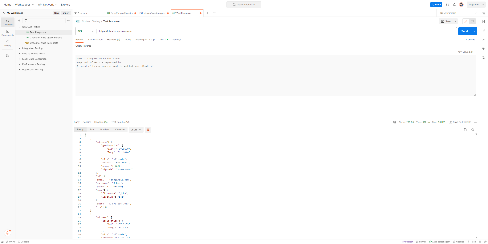
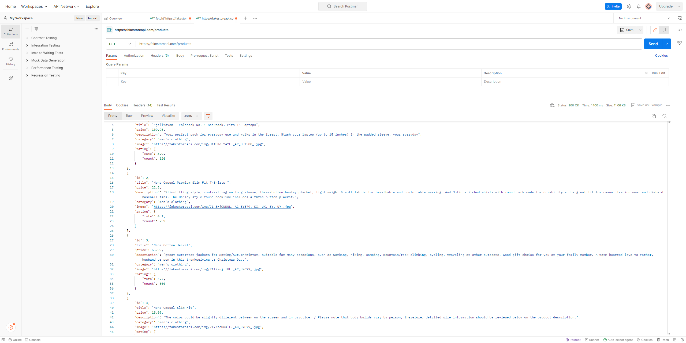

# CSC207 Project 
***
By: Kelsie Fung, Leo Li, Alyssa Lu, Glenn Li, David Lee
***

**Problem Domain**

Our team is tentatively interested in creating an online shopping platform.
* Users can view their shopping history.
* Users can browse products to purchase and sort by categories.
* Users can search for items they want.
* Users can add to cart and make payments.
* Makes use of an API for features of an online store.

**Application Description**

Our team  is thinking of developing an application where users are able to create
an account (with their username, password, email, and phone number), then login to the app. 
From there, they can go to their profile to view their past purchases, discounts, and 
other suggested items to buy that are personalized to their shopping history. 
There will be a class with methods that creates Customers as a subclass of Users, 
and their information will be stored as attributes.

On the shopping page, the users are able to sort the available products by different categories 
such as price, colour, type of clothing, etc. There should be a search feature for the user to type an 
object they are looking for, and the app will return a list of relevant products.
There can be a class for each category of item which extends the product class, containing the attributes 
by which the items can be sorted (price, colour, type of clothing, stock available, size).

Users will also be able to add items to their cart. 
There can be a class for cart which keeps track of the items being stored in it, 
and has an attribute for the total amount of items, quantity of each type of item,
the price, etc.

There can be a payment screen where users review their order in the cart and enter their information for payments.
There will be a class with methods that checks the validity of their information and 
confirms whether the payment went through.

There could also be an interface for the employees running the online store platform. 
There can be a separate login for them to add items to the store, and facilitate payments.
Employees can have their own class which is a subclass of Users.

**Documentation for a Related API**

Store API
https://fakestoreapi.com/docs
Payments API
https://developer.squareup.com/reference/square

***

**a screenshot of using a tool to try out the API**
(like https://www.postman.com/Links or https://hoppscotch.io/Links)

**example output of running your Java code.**

(TODO)

**a list of any technical problems blocking progress**

(TODO)

***
